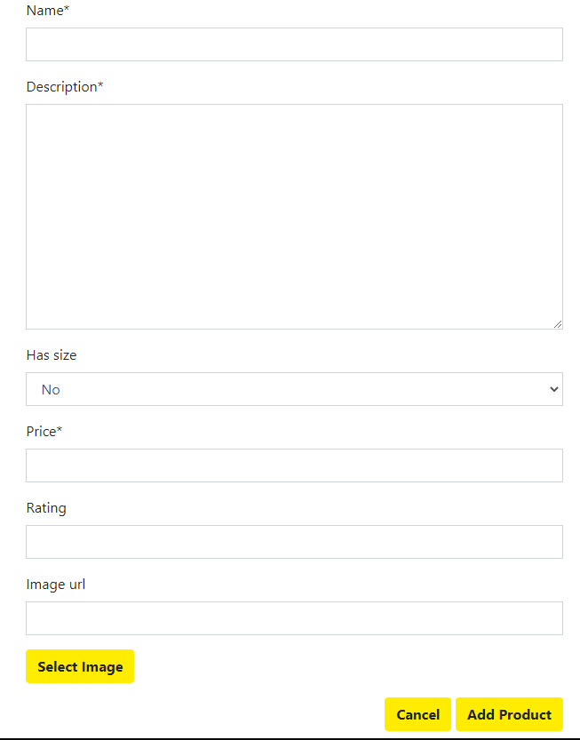

# Gold's Gym
The objective of this website is to advertise a specialist strength gym in order to attain new members, getting users to purchase membership to the gym and encouraging users to make purchases from the gym's store. The website will highlight the different unqiue selling points of the gym which includes:
- It's access to specialist strongman equipment such as logs and atlas stones
- The wide range of classes that are available to sign up too for gym members
- The specialist items available for purchase from the store.

The website also introduces you to the philosophy of the gym which, alongisde testomonials, show that Gold's Gym is the place to train if you have any interest in progessing in strength sports.  

### **Business Goals**
- To generate revenue for the gym by increasing the number of paid subscribers.
- To generate revenue for the gym via store sales
- To encourage long term members 
- To build a stronger online presence for the gym.

### **Customer Goals**
- Feel satisfied with the benefits of being a gym member
- Finding a gym to to begin training at
- Easy to sign up too and cancel a class. 
- It is easy to checkout from the store and complete my purchases quickly
## Table of Contents
1. [User Design](#ux)
2. [WireFrames](#wireframes)
3. [Features](#features)
4. [Data Structure](#data-structure)
5. [Technologies](#technologies-used)
6. [Testing](#testing)
7. [Deployment](#deployment)
8. [Credits](#credits)
## UX
---
### **Ideal User**
- Anyone with an interest in strength sports
- Anyone looking for a new gym
- Anyone looking for personal development  
- Anyone looking to take their sport to the next level
- Anyone in need of gym gear/supplements
### **User Stories**
As a guest user I want...
-	to immediately understand the sites purpose
-	site navigation to be intuitive.
-	to be able to see the available products
-	to be able to search the site for specific products
-	to be able to view individual product details
-	to be able to easily view the shopping bag
-	to be able to easily to adjust product quantities in the shopping bag
-	to be able to easily remove products form the shopping bag
-	to be given feedback when a bag adjustment is made
-	to receive order confirmation
-	to be able to easily create an account
-	to understand the benefits of being a registered user
-	the benefits of subscribing to the gym to be clear
-	to be able to choose from an option of subscriptions

As a registered user I want...
-	To be able to log in and out easily
-	To be able to reset my password if needed
-	To receive conformation I have registered for the site
-	To have a personalised profile
-	 To save/remove favourite products to/from my profile
-	To save my delivery details for faster checkout
-	To be able to update my delivery details
-	To be able to read the fitness blog

As a subscribed user I want...
-	My store discount to be obviously visible
-	To be able to sign up to a range of classes at the gym
-	To easily be able to change the class I am signed up to
-	To be reminded by email on the morning of a class

As a superuser I want…
-	To be easily able to add/edit and delete products
-	To be able to add blog posts
-	To be able to edit and delete all blog posts and comments
-	To be able to view and manage site users
-	To be able to view and manage the members store
-	To be able to add/edit and remove classes from the timetable
### **Design Choices**
#### **Font**
I chose the Goblin One font for the headings, the styling of the text closely resembles the styling of the text in the logo and stands out well on background images. 
I chose the Raleway font for all body text as it looks elegant and nicely complements the Goblin One font.
#### **Icons**
I used Font Awesome icons for my social media links, favourite button, the shopping cart and users navigation items to name a few  as it gives a intuitive way for users to easily navigate across the site.
#### **Colors**
The color scheme was entirely based around the colour of the logo - I used dev tools to get the exact hex colour of both the yellow background and grey text.
### **Wireframes**

Homepage

About

Registration

Profile

Classes

Membership

All Products

Product Details

Shopping Bag

Checkout

Checkout Success

## **Features**
---
### **Existing Features**
#### Home Page
- Advertises the site key features of the site, the store an the gym classes. The home page has clear call to action buttons to encourage users to sign up. In addition the homepage contains a carousel of products taken from the store to display to the user to encoruage the user to visit the store.

#### Membership Page
- The membership page describes the benefits of being a member and encourages the user to sign up to the site, the information displayed varies depending on the users membership status.

Anonymous user

Bronze user

Silver user

Gold user

#### Classes Page
- The classes page shows both basic and bronze users the types of classes that the gym runs. If you are a gold or silver level member of the gym then you are able to sign up to the different classes using the classes table. 
- Each row in the table is a button that will send a AJAX post to the python view to add or remove a user to a particular class. Users can sign up to the class by clicking on the button, the second click on the button will remove the user from the class. If a class is full it will appear red and you will be unable to sign up to the class.

#### Store Page
- The store page allows you to view all the products in the store and filter them to allow you to find the item you wish to purchase
- There are 4 clear images that allow you to refine your searches as well as a store navigation menu which allows for even further refining of your search

- Product odering my options like price, rating and name in descending or ascending order can be accessed in the menu highlited blue in the below image. In this image the products are arranged by price in descending order.

- Each image of a product acts as a url to the product details

#### Product Details
- The product details page offers you options to add the item to your shopping bag, to add the items to your favourite list (if you an authenticated user) and to adjust the quanitiy of the item you want. 

- adding an item to your shopping bag will provide you with a toast success message, the shopping cart icon will also update with the number of items in your cart making it easier to keep track of potential spendings.

#### Shoppng Bag
- The shopping bag allows you to view all the items in your page, presents a nicely layed out costs and gives you the option to proceed to the checkout page.

#### Checkout 
-The checkout page allows you to compelte your shipping information and to make a stripe payment to checkout. Upon successful completion a conformation email is sent to users and they are redirected to a success page.
If you are signed in and have previously saved delivery information then it will autopopulate. Authenticated users also have the ability to save their checkout information during the checkout process.
 
#### Profile
- The profile page allows a user to view any items that they have saved as their favourites, to edit their default billing information or to see any of the classes that they have singed up too.
 
#### Product Management
- Admin users have access to product management which allows them to add products to the database alongside being able edit/delete products using convenient buttons in both the products detail view and store view.
 
### Features left to implement

## **Data Structure**
---
## Technologies Used
---
## Testing
---
**For the testing please see [testing.md](TESTING.md)**
## Deployment
---
The project was hosted on Github and deployed through heroku. 
### Requirements to deploy the project are a:
- Python 3 developing environment
- Github account
- Stripe account
- Heroku account
- AWS account (free tier)

### Step 1 - Clone my repository
- To clone my repository you first need to logged into github and go to [my repository](https://github.com/JohnGC1510/milestone_project_4)
- Click on the "code" button just above the files
- Click "Open with GitHub Desktop" and follow the instructions in the GitHub desktop application. Other ways to clone a repository can be found [here](https://docs.github.com/en/github/creating-cloning-and-archiving-repositories/cloning-a-repository#cloning-a-repository-to-github-desktop) 