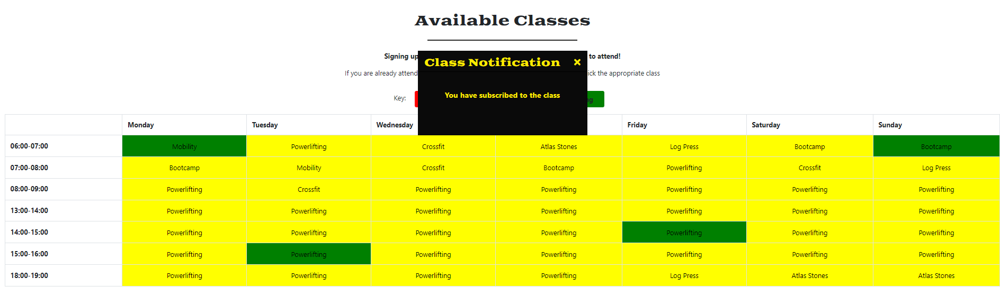

# Gold's Gym
The objective of this website is to advertise a specialist strength gym in order to attain new members, getting users to purchase membership to the gym and encouraging users to make purchases from the gym's store. The website will highlight the different unqiue selling points of the gym which includes:
- It's access to specialist strongman equipment such as logs and atlas stones
- The wide range of classes that are available to sign up too for gym members
- The specialist items available for purchase from the store.

The live version of the webiste can be found [here](https://golds-gym.herokuapp.com/)

To test purchases on the site please use the following card details:
- Card Number: 4242 4242 4242 4242
- Exp date: 04/24
- CVC: 424
- ZIP: 42424
### **Business Goals**
- To generate revenue for the gym by increasing the number of paid subscribers.
- To generate revenue for the gym via store sales
- To encourage long term members 
- To build a stronger online presence for the gym.

### **Customer Goals**
- Feel satisfied with the benefits of being a gym member
- Finding a gym to to begin training at
- Easy to sign up too and cancel a class. 
- It is easy to checkout from the store and complete my purchases quickly
## Table of Contents
1. [User Design](#ux)
2. [WireFrames](#wireframes)
3. [Features](#features)
4. [Data Structure](#data-structure)
5. [Technologies](#technologies-used)
6. [Testing](#testing)
7. [Deployment](#deployment)
8. [Credits](#credits)
## UXs
---
### **Ideal User**
- Anyone with an interest in strength sports
- Anyone looking for a new gym
- Anyone looking for personal development  
- Anyone looking to take their sport to the next level
- Anyone in need of gym gear/supplements
### **User Stories**
As a guest user I want...
-	to immediately understand the sites purpose
-	site navigation to be intuitive.
-	to be able to see the available products
-	to be able to search the site for specific products
-	to be able to view individual product details
-	to be able to easily view the shopping bag
-	to be able to easily to adjust product quantities in the shopping bag
-	to be able to easily remove products form the shopping bag
-	to be given feedback when a bag adjustment is made
-	to receive order confirmation
-	to be able to easily create an account
-	to understand the benefits of being a registered user
-	the benefits of subscribing to the gym to be clear
-	to be able to choose from an option of subscriptions


As a registered user I want...
-	To be able to log in and out easily
-	To be able to reset my password if needed
-	To receive conformation I have registered for the site
-	To have a personalised profile
-	 To save/remove favourite products to/from my profile
-	To save my delivery details for faster checkout
-	To be able to update my delivery details
-	To be able to read the fitness blog


As a subscribed user I want...
-	My store discount to be obviously visible
-	To be able to sign up to a range of classes at the gym
-	To easily be able to change the class I am signed up to
-	To be reminded by email on the morning of a class

As a superuser I want…
-	To be easily able to add/edit and delete products
-	To be able to add blog posts
-	To be able to edit and delete all blog posts and comments
-	To be able to view and manage site users
-	To be able to add/edit and remove classes from the timetable
### **Design Choices**
#### **Font**
I chose the Goblin One font for the headings, the styling of the text closely resembles the styling of the text in the logo and stands out well on background images. 
I chose the Raleway font for all body text as it looks elegant and nicely complements the Goblin One font.
#### **Icons**
I used Font Awesome icons for my social media links, favourite button, the shopping cart and users navigation items to name a few  as it gives a intuitive way for users to easily navigate across the site.
#### **Colors**
The color scheme was entirely based around the colour of the logo - I used dev tools to get the exact hex colour of both the yellow background and grey text.
### **Wireframes**
<details><summary>Homepage</summary>
<p>


</p>
</details>

<details><summary>About</summary>
<p>


</p>
</details>

<details><summary>Registration</summary>
<p>


</p>
</details>

<details><summary>Profile</summary>
<p>


</p>
</details>

<details><summary>Classes</summary>
<p>


</p>
</details>

<details><summary>Membership</summary>
<p>


</p>
</details>

<details><summary>All Products</summary>
<p>


</p>
</details>

<details><summary>Product Details</summary>
<p>


</p>
</details>

<details><summary>Shopping Bag</summary>
<p>


</p>
</details>

<details><summary>Checkout</summary>
<p>


</p>
</details>

<details><summary>Checkout Success</summary>
<p>


</p>
</details>

## **Features**
---
### **Existing Features**
#### Home Page
- Advertises the site key features of the site, the store an the gym classes. The home page has clear call to action buttons to encourage users to sign up. In addition the homepage contains a carousel of products taken from the store to display to the user to encoruage the user to visit the store.

#### Membership Page
- The membership page describes the benefits of being a member and encourages the user to sign up to the site, the information displayed varies depending on the users membership status.
<details><summary>Anonymous user</summary>
<p>


</p>
</details>
<details><summary>Bronze user</summary>
<p>


</p>
</details>
<details><summary>Silver user</summary>
<p>


</p>
</details>
<details><summary>Gold user</summary>
<p>


</p>
</details>

#### Classes Page
- The classes page shows both basic and bronze users the types of classes that the gym runs. If you are a gold or silver level member of the gym then you are able to sign up to the different classes using the classes table. 
- Each row in the table is a button that will send a AJAX post to the python view to add or remove a user to a particular class. Users can sign up to the class by clicking on the button, the second click on the button will remove the user from the class. If a class is full it will appear red and you will be unable to sign up to the class.



#### Store Page
- The store page allows you to view all the products in the store and filter them to allow you to find the item you wish to purchase
- There are 4 clear images that allow you to refine your searches as well as a store navigation menu which allows for even further refining of your search

- Product odering my options like price, rating and name in descending or ascending order can be accessed in the menu highlited blue in the below image. In this image the products are arranged by price in descending order.

- Each image of a product acts as a url to the product details

#### Product Details
- The product details page offers you options to add the item to your shopping bag, to add the items to your favourite list (if you an authenticated user) and to adjust the quanitiy of the item you want. 

- adding an item to your shopping bag will provide you with a toast success message, the shopping cart icon will also update with the number of items in your cart making it easier to keep track of potential spendings.

#### Shoppng Bag
- The shopping bag allows you to view all the items in your page, presents a nicely layed out costs and gives you the option to proceed to the checkout page.

#### Checkout 
-The checkout page allows you to compelte your shipping information and to make a stripe payment to checkout. Upon successful completion a conformation email is sent to users and they are redirected to a success page.
If you are signed in and have previously saved delivery information then it will autopopulate. Authenticated users also have the ability to save their checkout information during the checkout process.
 
#### Profile
- The profile page allows a user to view any items that they have saved as their favourites, to edit their default billing information or to see any of the classes that they have singed up too.
 
#### Product Management
- Admin users have access to product management which allows them to add products to the database alongside being able edit/delete products using convenient buttons in both the products detail view and store view.
 
### **Features to imporve**
I would like to improve all of the following features given appropriate time:
- The classes page requires imporvement with better custom notifcations when you sign up to a class and with a completely different structure on mobile devices as having to scroll across a table is a poor user experience.
- The actual implementation of the classes model could be improved upon by using a dateTime model and generating a weekly schedule of classes. You would then only be able to subscribe to classes in the future and this would also be a more realistic for a gym to have.
- The html page in classes is poorly constructed with a brute force method of if statements, improving the model would allow for much less html which would improve the websites performace.
- The product details page would have been improved with a feature that added a carousel of recommened items based on the current item that you are viewing.
### **Features to add**
I would like to add the following features given appropriate time:
- The current method of getting a membership to the website does not reflect the common system for gyms, you are only able to purchase a membership as a product in the store. I would like to implement a subscription system to allow members to pay for their membership on a monthly basis.
- I would like to improve the stripe payment method so that it does not rely an american zip code to proccess a payment
- I would like to add an about us gym page to better advertise to potential users 
- I would like to add a strongman/powerlifting blog to allow users to get relevant information on current local and international strongman and powerlifting events.


## **Data Structure**
---
A relational database was used in this project, I intially started development with SQlite3 however had to move development over to a Heroku Postgres database before the end of the project due to the use of ArrayFields in some of my data strucutres. The database used in production is also a Heroku postgres database.
### Initial data strucutres
---
Before starting the project I outlined what I thought the different models I was using would look like:

- The purpose of the class model was to allow users to sign up to a gym class


- The user model was to be updated with member_types to contorl access to different parts of the site and additonal information was to be used from the base django user class to make the profile page more personable


- The favourites model was to allow users to select favourite products to be viewed on thier profile page.


### **Final data strucutres**
---
Classes changes:
 - It worked better having the classes foreign key in the user field as it is very simple in django to obtain the current users username, hence the foreign key was not needed. The dateTime field proved to difficult to implement effectively so I repalced it with a day and time for the class, this meant I had to ensure strings were identical and gave very little flexibility when creating the view. However due to time constraints and level of scope I was not able to implement the dateTime field.

 

User changes:
-  When creating the intial datat structure I did not take into accoutn a user would want to save delivery data so appropriate field were added. To implement the member_types I used
a positive small integer field with a choice between either 1, 2 or 3 with each number representing a different level of gym membership. I represented the membership types using integers as it made it much easier when accessing the data to modify the UserProfile in the checkout view.
- I did not add the types such as name - these are not included in the default django user model and it was out of scope to edit this model to allow for a more personable interface. Ideally I would add these fields given more time. 
 

 Favourites model:
 - the final model was essentially identical to the initial model however instead of a user foreignkey I used a char field as request.user readily returned a unqiue user name that I could store and having a unique string field related to each array made operations in the profile view much easier.
 


## Technologies Used
---
Designed with HTML5, CSS3, JavaScript, Python3 with the Django Framework

### Languages
[HTML5](https://en.wikipedia.org/wiki/HTML5)

[CSS3](https://en.wikipedia.org/wiki/Cascading_Style_Sheets)

[JavaScript](https://en.wikipedia.org/wiki/JavaScript)

[Python](https://en.wikipedia.org/wiki/Python_(programming_language))

### Integration

[Bootstrap](https://getbootstrap.com/) - by linking via [Bootstrap CDN](https://www.bootstrapcdn.com/) to HTML Doc

[FontAwesome](https://fontawesome.com/) Icons for Social Media links

 [Google Fonts](https://fonts.google.com/) - Overall Typography import

[jQuery](https://jquery.com/) - JavaScript library

[Django](----------------------) Micro web framework written in Python

### Tools

[Git](https://git-scm.com/) - Distributed Version Control

[GitHub](https://github.com/) - A cloud-based hosting service to manage Git repositories

[Heroku](https://heroku.com) - Container-based cloud platform for deployment and running of apps

[AWS S3](https://aws.amazon.com/s3/) - Cloud storage for static and media files

### Code Validity
- HTML - [W3C](https://validator.w3.org/) - Markup Validation
- CSS - [W3C](https://jigsaw.w3.org/css-validator/) - Jigsaw CSS Validation
- JavaScript - [JSHINT](https://jshint.com/) - JavaScript code warning & error check
- Python - [Pyton Tester](https://extendsclass.com/python-tester.html) Python code syntax checker

## Testing
---
**For the testing please see [testing.md](TESTING.md)**
## Deployment
---
The project was hosted on Github and deployed through heroku. 
### Requirements to deploy the project are a:
- Python 3 developing environment
- Github account
- Stripe account
- Heroku account
- AWS account (free tier)
### **Setting up gitpod development environment**
### Step 1 - Clone my repository
- To clone my repository you first need to logged into github and go to [my repository](https://github.com/JohnGC1510/milestone_project_4)
- Click on the "code" button just above the files
- Click "Open with GitHub Desktop" and follow the instructions in the GitHub desktop application. 
- Alternatively copy the URL and clone the repository in your local ID using
```
git clone https://github.com/JohnGC1510/milestone_project_4.git
```
### Step 2 - Working with local clone
-  To work with the local clone you need to ensure all environmental variables have been set in an env.py file. These variables are private so ensure that you have a .gitignore file that prevents your env.py file being pushed to github. An example of a env.py file can be seen below:
```
import os

os.environ['SECRET_KEY'] = '************************************'
DEVELOPMENT = True
os.environ['STRIPE_PUBLIC_KEY'] = '******************************'
os.environ['STRIPE_SECRET_KEY'] = '********************************'
os.environ['STRIPE_WH_SECRET'] = '************************************************'
```
### Step 2.1 - Getting the environment variables
- To set up all the environmental variables above you will need have made a Stripe account. 
- STRIPE_PUBLIC_KEY = Publishable key, STRIPE_SECRET_KEY = Secret key, never reveal your secret key.
- To get the WH secret you need to setup a webhook, on the lefthand menu of the page click on developes and navigate to the Webhooks page.
- Click the button + Add Endpoint and complete the form by adding you local development environment as the URL (do not forget to end in a / eg. 
`my-local-env.gitpod.io/checkout/wh/`  ) and click the receive all events link in the middle of the box.
- You now have a webhook with a signing secret, this is your WH secret variable.
### Step 2.2 - Installing dependencies
- When cloning the project you should cloned the requiremnts.txt file, if this is not the case then use the following command in the CLI:
```
$ pip3 freeze -- local > requirements.txt
```
This file will contain a list of dependencies for the project. These can be installed with the following command in the CLI:
```
$ pip install -r requirements.txt
```

- Ensure you have a procfile as this will tell heroku how to run the application. A procfile can be created in the CLI using:
```
$ echo web: python app.py > Procfile
```

- Ensure you have added a .gitignore file to prevent any private data being pushed to github and make sure to include the following
```
    core.Microsoft*
    core.mongo*
    core.python*
    env.py
    __pycache__/
    *.py[cod]
    venv
    .vscode
    *.sqlite3
    *.pyc
```
### Step 2.3 - Database migrations
- Apply model migrations useing `python manage.py migrate`
- load the data into the environment from the fixures files using the commands
```
python3 manage.py loaddata categories
python3 manage.py loaddata products
python3 manage.py loaddata classes
```

### Step 2.4 - Creating a superuser
- Type `python manage.py createsuperuser` into the terminal and follow the prompts.

### Step 2.5 Run locally
- The project should now be ready to run locally by typing `python manage.py runserver` and selecting port 8000. 
- Ensure port 8000 is set to public and not private
### Step 3 Deploying to Heroku
In Heroku all the static files are hosted in an S3 bucket in aws, so before you beign to do anything else you need to login to/create an aws account.
     
### Step 3.01 - create the bucket
- search for S3 and click on it  
- select the geographic region closest to you
- uncheck block all public access
- click create bucket
- In the **properties section** of the bucket:
    - turn on static web hosting
    - fill in some default values for the index and error documents
    - click save
- In the **permissions section** of the bucket:
    - add the **_cors configuration_**
- Go to the **bucket policy section**
    - select policy generator
    - policy type will be **_s3 bucket policy_**
    - allow all principals by using *
    - the action will be **_get object_**
    - copy the **ARN** and paste it into the **_arn box_**
    - click **_Add Statement_**
    - then **_generate policy_**
    - copy this policy into the **_bucket policy editor_**
    - allow access to all resources in this bucket by adding a /* to the end of the resource key
    - click save
- Go to the **access control list section**
    - set the list objects permission for everyone under the Public Access section 

### Step 3.02 - create a user to access the bucket
- from the services menu open **Iam**
- click groups
- create a new group
### Step 3.03 - Create the policy used to access the bucket
- click policies
- create policy
- go to the **_JSON tab_**
- select **_import managed policy_**
- search for **_s3_**
- import the **_s3 full access policy_**
- get the **_bucket ARN_** from the bucket policy page in s3
- paste it in
- click review policy
- give it a name and description
- click create policy
### Step 3.04 Attach the policy
- go to groups
- click on the group you created
- select attach policy option
- search for the policy you just created and select it
- Finally click attach policy
### Step 3.05 Create a user
- on the users page click **_add user_**
- give it a name and **_programmatic access_**
- select next
- click through to the end and then **_create user_**
 - download the **CSV file** which will contain the **_user access key_** and **_secret access key_** which need to be added to the Heroku config vars  
 ### Step 3.1 Connecting Heroku to GitHub
 The project will automatically deploy to heroku after the following has been completed:
- Once you are logged in to Heroku create a new app selecting the appropriate region.

- Choose Deployment method "GitHub" (if this section is accidentally missed, you can use the tab selection within your dashboard "DEPLOY")

- - Select the "connect to GitHub" button and search for your repository using the form provided.

### Step 3.2 Setting up email notifcations
- Setup a gmail account to allow emails to be sent - in gmail settings enable 2-step verification
- Create an app password by selecting a 'mail' app and setting device type to other - name it as suits you

### Step 3.3 Add the database
- In your herokuapp navigate to the resources page, search for and select 'Heroku  Postgres'


### Step 3.4 Adding congif variables
- Navigate to the "Settings" tab in the heroku app
- Scroll to the section "Config Vars" and click "reveal config vars" button
- Ensure all the following config vars are configured:
```
AWS_ACCESS_KEY_ID
AWS_SECRET_ACCESS_KEY
DATABASE_URL (set automatically by Postgres)
EMAIL_HOST_PASS (gmail app password)
EMAIL_HOST_USER (your gmail)
SECRET_KEY (djnago secret key)
STRIPE_PUBLIC_KEY
STRIPE_SECRET_KEY
STRIPE_WH_SECRET
USE_AWS = 1
```
### Step 3.5 Deploy the application to Heroku
- Navigate back to the "Deploy" tab:
- Scroll to automatic deploys and enable automatic deployment.
- Scroll to the "Manual Deploy" tab:
    1. Select the branch you wish to deploy (master is default)
    2. Click the "Deploy Branch" button. (This may take some time as Heroku uploads the app to their servers.) 

- Once the build is complete, a "View App" button will appear and you should be informed that the app has successfully deployed.

- Common issues include outdated requirements.txt and/or missing Procfile, if errors occur, check these are both correct before investigating further 


